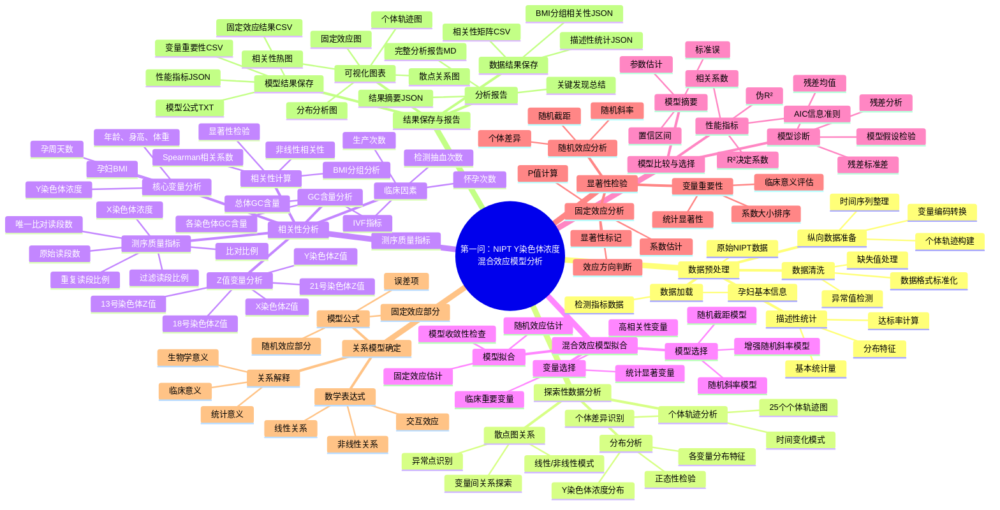

# 第一问：NIPT Y染色体浓度混合效应模型分析 - 详细思维导图

## 思维导图

## 详细分析流程说明

### 1. 数据预处理阶段
- **数据加载**：读取原始NIPT检测数据，包括孕妇基本信息、检测指标等
- **数据清洗**：处理缺失值、异常值，确保数据质量
- **纵向数据准备**：将数据转换为适合混合效应模型分析的纵向格式
- **描述性统计**：计算基本统计量，了解数据分布特征

### 2. 探索性数据分析阶段
- **个体轨迹分析**：绘制25个代表性个体的Y染色体浓度变化轨迹
- **分布分析**：分析各变量的分布特征，检验正态性
- **散点图关系**：探索变量间的线性/非线性关系模式

### 3. 相关性分析阶段
- **核心变量**：Y染色体浓度、孕周、BMI、年龄等基础变量
- **Z值变量**：各染色体的Z值，反映检测质量
- **GC含量**：测序质量的重要指标
- **测序质量指标**：原始读段数、比对比例等技术指标
- **临床因素**：IVF、怀孕次数等临床相关变量
- **相关性计算**：使用Spearman相关系数进行全面的相关性分析

### 4. 混合效应模型拟合阶段
- **模型选择**：从简单到复杂的模型选择策略
- **变量选择**：基于相关性分析结果选择重要变量
- **模型拟合**：估计固定效应和随机效应参数

### 5. 模型比较与选择阶段
- **模型摘要**：获取详细的参数估计结果
- **性能指标**：计算相关系数、R²、AIC等指标
- **模型诊断**：进行残差分析，检验模型假设

### 6. 显著性检验阶段
- **固定效应分析**：确定哪些变量对Y染色体浓度有显著影响
- **变量重要性**：评估各变量的相对重要性
- **随机效应分析**：分析个体间的差异

### 7. 关系模型确定阶段
- **数学表达式**：建立最终的数学关系模型
- **模型公式**：明确固定效应、随机效应和误差项
- **关系解释**：从生物学、临床和统计学角度解释模型

### 8. 结果保存与报告阶段
- **模型结果保存**：保存所有模型相关结果
- **数据结果保存**：保存分析过程中的数据结果
- **可视化图表**：生成各种分析图表
- **分析报告**：生成完整的分析报告和摘要

## 关键特点

1. **全面性**：涵盖了从数据预处理到最终报告生成的完整流程
2. **系统性**：每个步骤都有明确的目标和方法
3. **科学性**：采用混合效应模型处理纵向数据
4. **实用性**：结果可直接用于临床决策支持
5. **可重现性**：所有分析步骤都有详细的代码实现

这个思维导图为您提供了第一问分析的完整框架，可以作为分析工作的指导蓝图。