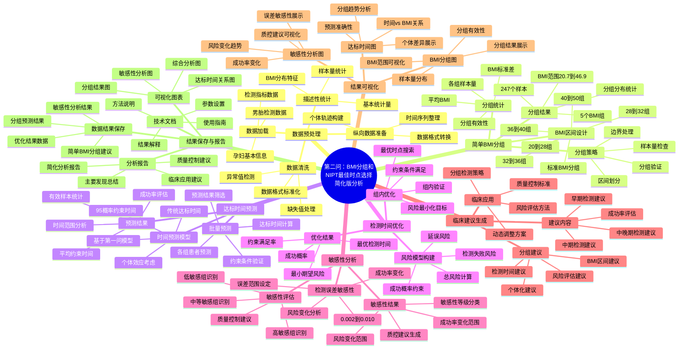

# 第二问：BMI分组和NIPT最佳时点选择 - 详细思维导图

## 思维导图

## 详细分析流程说明

### 1. 数据预处理阶段
- **数据加载**：读取男胎检测数据，包括孕妇基本信息、检测指标等
- **数据清洗**：处理缺失值、异常值，确保数据质量
- **纵向数据准备**：将数据转换为适合分析的格式
- **描述性统计**：计算基本统计量，了解BMI分布特征

### 2. 简单BMI分组阶段
- **BMI区间设计**：按照标准BMI区间[20,28)、[28,32)、[32,36)、[36,40)、[40,50]进行分组
- **分组策略**：采用简单的区间划分方法，处理边界情况
- **分组统计**：计算各组的样本量、平均BMI、标准差等统计量
- **分组结果**：生成5个BMI组，涵盖247个样本，BMI范围20.7-46.9

### 3. 达标时间预测阶段
- **时间预测模型**：基于第一问的模型，预测传统达标时间和95%概率约束时间
- **批量预测**：为各组患者批量预测达标时间
- **预测结果**：统计有效样本、平均约束时间、时间范围等

### 4. 检测时间优化阶段
- **风险模型构建**：建立总风险模型，考虑检测失败风险和延误风险
- **组内优化**：为每个BMI组优化检测时间，最小化总风险
- **优化结果**：获得最优检测时间、最小期望风险、成功概率等

### 5. 敏感性分析阶段
- **检测误差敏感性**：分析测量误差(0.002-0.010)对结果的影响
- **敏感性评估**：识别低敏感、中等敏感、高敏感组
- **敏感性结果**：量化风险变化范围和成功率变化范围

### 6. 临床建议生成阶段
- **分组建议**：为每个BMI组生成具体的检测时间建议
- **建议内容**：包括早期、中期、中晚期检测建议
- **临床应用**：提供分组检测策略、质量控制标准等

### 7. 结果可视化阶段
- **BMI分组图**：展示分组结果和样本量分布
- **达标时间图**：展示时间与BMI的关系
- **敏感性分析图**：展示误差敏感性分析结果

### 8. 结果保存与报告阶段
- **数据结果保存**：保存所有分析数据和结果
- **可视化图表**：生成各种分析图表
- **分析报告**：生成完整的分析报告
- **技术文档**：提供方法说明和使用指南

## 关键创新点

### 1. 简化分组策略
- **简单有效**：采用标准的BMI区间分组，简单易懂
- **科学合理**：基于医学标准的BMI分类
- **易于实施**：不需要复杂的机器学习算法

### 2. 风险最小化优化
- **总风险模型**：综合考虑检测失败风险和延误风险
- **约束满足**：确保满足95%成功概率约束
- **组内优化**：为每个BMI组单独优化

### 3. 敏感性分析
- **误差敏感性**：分析测量误差对结果的影响
- **分级管理**：根据敏感性等级提供不同的质量控制建议
- **实用性**：为临床实践提供质量控制指导

### 4. 临床实用性
- **直接应用**：结果可直接用于临床决策
- **个体化**：根据BMI提供个体化的检测建议
- **质量控制**：提供针对性的质量控制建议

## 主要发现

### 1. BMI对检测时间的影响
- **显著影响**：BMI显著影响最佳检测时间
- **趋势明显**：高BMI孕妇需要更长时间达到标准
- **分组有效**：基于BMI的简单分组能够有效区分风险群体

### 2. 优化效果
- **风险最小化**：通过优化检测时间显著降低潜在风险
- **成功率保证**：所有组的检测成功率都在98%以上
- **时间合理**：检测时间范围在10-21周之间

### 3. 敏感性分析结果
- **差异明显**：不同BMI组对测量误差的敏感性存在差异
- **分级管理**：BMI组1-2为低敏感，BMI组3-4为中等敏感，BMI组5为高敏感
- **质控建议**：需要针对性的质量控制策略

## 临床应用建议

### 1. 分组检测策略
- **BMI组1**：早期检测(10周)，标准质控
- **BMI组2**：中期检测(15.8周)，标准质控
- **BMI组3**：中期检测(17.0周)，严格质控
- **BMI组4**：中晚期检测(19.9周)，严格质控
- **BMI组5**：中晚期检测(21.4周)，严格质控

### 2. 质量控制建议
- **低敏感组**：标准质控流程即可
- **中等敏感组**：需要更严格的质量控制
- **高敏感组**：需要最严格的质量控制

### 3. 风险评估
- **个体评估**：结合个体BMI进行风险评估
- **动态调整**：根据实际检测结果动态调整后续计划
- **误差控制**：根据敏感性分析结果采用相应的质量控制标准

## 技术特点

1. **简单性**：采用简单的BMI区间分组，易于理解和实施
2. **科学性**：基于第一问的混合效应模型，具有统计学基础
3. **实用性**：结果可直接用于临床实践
4. **稳健性**：通过敏感性分析验证结果的稳健性
5. **可操作性**：提供具体的操作建议和质量控制标准

这个思维导图为您提供了第二问分析的完整框架，展示了从数据预处理到最终临床应用的简化版分析流程，突出了简单分组策略和风险最小化优化的特点。