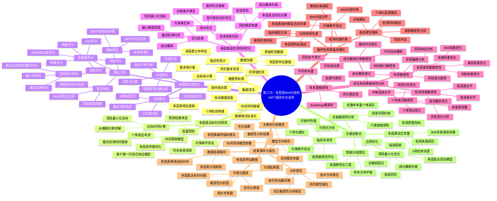

# 第三问：多因素BMI分组和NIPT最佳时点选择 - 详细思维导图

## 思维导图

## 详细分析流程说明

### 1. 数据预处理阶段
- **数据加载**：读取男胎检测数据，包括孕妇基本信息、检测指标等
- **数据清洗**：处理缺失值、异常值，确保数据质量
- **纵向数据准备**：将数据转换为适合多因素分析的格式
- **描述性统计**：计算基本统计量，了解多因素分布特征

### 2. 多因素达标时间预测阶段
- **时间预测模型**：基于第一问的混合效应模型，考虑多因素影响
- **达标时间计算**：求解满足95%概率约束的最早时间
- **批量预测**：为所有患者预测多因素达标时间

### 3. 多因素分组优化阶段
- **特征工程**：构建丰富的多因素特征，包括基础特征、时间相关特征、多因素评分、复合指标
- **分组算法**：使用决策树回归进行智能分组
- **分组优化**：平衡样本分布，优化分组边界

### 4. 多因素组检测时间优化阶段
- **风险模型构建**：建立多因素总风险模型
- **组内优化**：为每个分组优化检测时间
- **优化结果**：获得最优检测时间和风险水平

### 5. 综合多因素敏感性分析阶段
- **检测误差敏感性**：分析不同误差水平对结果的影响
- **孕周敏感性**：分析孕周偏移对风险的影响
- **成功概率约束敏感性**：分析不同约束水平的影响
- **多因素权重敏感性**：分析各因素权重变化的影响
- **样本量敏感性**：通过Bootstrap分析结果稳定性
- **个体差异敏感性**：分析个体差异对结果的影响

### 6. 最终多因素临床建议阶段
- **分组规则生成**：生成具体的分组规则和临床建议
- **约束条件验证**：验证所有约束条件是否满足
- **临床建议输出**：输出个体化的临床建议

### 7. 结果保存与报告阶段
- **数据结果保存**：保存所有分析数据
- **模型文件保存**：保存训练好的模型
- **可视化图表**：生成各种分析图表
- **分析报告**：生成完整的分析报告

## 关键创新点

### 1. 多因素综合考量
- 不仅考虑BMI，还综合考虑年龄、身高、体重、X染色体浓度、检测质量指标、临床因素等
- 构建多因素评分系统，量化各因素的影响

### 2. 智能分组算法
- 使用决策树回归进行分组，能够捕捉复杂的非线性关系
- 通过多因素特征工程，构建丰富的特征空间
- 自动平衡样本分布，确保分组的合理性

### 3. 风险最小化优化
- 建立多因素总风险模型，同时考虑检测失败风险和延误风险
- 在满足成功概率约束的前提下，最小化总风险
- 验证组内稳妥达标约束

### 4. 全面敏感性分析
- 六维度敏感性分析：误差、孕周、约束、权重、样本量、个体差异
- 通过可视化分析，直观展示敏感性结果
- 为临床决策提供可靠性评估

### 5. 临床实用性
- 提供个体化的临床建议
- 验证所有约束条件
- 评估误差敏感性
- 建议可操作性强

## 技术特点

1. **科学性**：基于第一问的混合效应模型，具有坚实的统计学基础
2. **全面性**：综合考虑多个因素，避免单一指标的局限性
3. **智能性**：使用机器学习算法进行智能分组
4. **稳健性**：通过敏感性分析验证结果的稳健性
5. **实用性**：提供具体的临床操作建议

这个思维导图为您提供了第三问分析的完整框架，展示了从数据预处理到最终临床建议的全过程，突出了多因素综合考量和智能优化的特点。