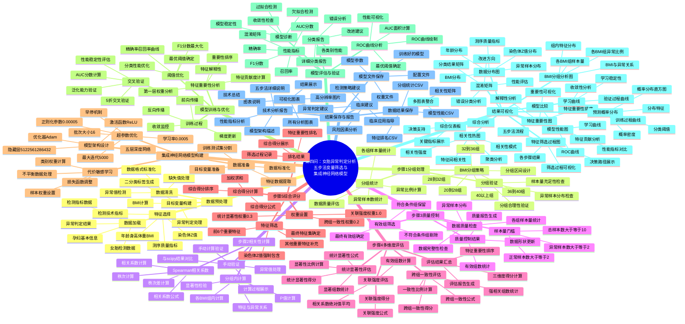

# 第四问：女胎异常判定分析 - 详细思维导图

## 思维导图

## 详细分析流程说明

### 1. 数据预处理阶段
- **数据加载**：读取女胎检测数据，包括异常判定结果、孕妇基本信息、检测指标等
- **数据清洗**：处理缺失值、异常值，确保数据质量
- **目标变量构建**：将异常判定结果转换为二分类标签
- **特征选择**：选择年龄、身高、体重、BMI、测序质量指标、染色体Z值等关键特征

### 2. 步骤1：分组处理阶段
- **BMI分组策略**：按照[20,28)、[28,32)、[32,36)、[36,40)、≥40的区间进行分组
- **分组统计**：计算各组的样本量、异常样本数、异常比例
- **分组验证**：检查分组的合理性和数据质量

### 3. 步骤2：相关性计算阶段
- **Spearman相关系数**：使用公式 r = 1 - (6 * Σd²) / (n * (n² - 1)) 计算
- **分组内计算**：在每个BMI组内计算特征与异常结果的相关性
- **手动验证**：手动计算验证结果，确保计算准确性

### 4. 步骤3：质量控制阶段
- **样本量门槛**：设置总样本数≥10、异常样本数≥2、正常样本数≥2的门槛
- **数据质量检查**：检查各组的数据质量和完整性
- **有效组筛选**：保留符合质量标准的组，剔除不符合的组

### 5. 步骤4：多维度评估阶段
- **关联强度评估**：S1_i = |r_i| = (1/G'_i) * Σ|r_{i,g}|
- **统计显著性评估**：S2_i = N_sig,i / G'_i
- **跨组一致性评估**：S3_i = N_high,i / G'_i
- **评估结果汇总**：计算三维度得分，进行特征重要性排序

### 6. 步骤5：综合评分阶段
- **权重设置**：关联强度1.0、统计显著性0.3、跨组一致性0.2
- **综合得分计算**：S_i = S1_i + 0.3 * S2_i + 0.2 * S3_i
- **特征筛选**：选择前6个重要特征，强制包含染色体Z值
- **排名结果**：生成最终的特征重要性排名

### 7. 集成神经网络模型构建阶段
- **数据准备**：特征提取、数据分割、标准化处理
- **模型架构设计**：五层深度网络(512, 256, 128, 64, 32)
- **超参数优化**：学习率、正则化、批次大小等参数优化
- **代价敏感学习**：处理类别不平衡问题

### 8. 模型训练与优化阶段
- **训练过程**：前向传播、反向传播、梯度更新
- **阈值优化**：基于F1分数最大化确定最优阈值
- **交叉验证**：5折交叉验证评估模型稳定性
- **特征重要性分析**：分析各特征对模型的贡献

### 9. 模型评估与验证阶段
- **性能指标**：AUC、精确率、召回率、F1分数等
- **ROC曲线分析**：绘制ROC曲线，计算AUC面积
- **分类报告**：生成详细的分类性能报告
- **模型诊断**：检查模型收敛性和稳定性

### 10. 结果可视化阶段
- **数据分布图**：展示数据的基本分布特征
- **BMI分组分析图**：分析各BMI组的异常情况
- **相关性热图**：展示特征间的相关性
- **特征筛选过程图**：可视化五步法筛选过程
- **模型性能图**：展示模型的各种性能指标
- **综合仪表板**：整合所有关键信息

### 11. 结果保存与报告阶段
- **数据结果保存**：保存所有分析数据和结果
- **模型文件保存**：保存训练好的模型和参数
- **可视化图表**：生成所有分析图表
- **技术分析报告**：生成完整的技术分析报告
- **临床建议**：提供临床应用建议

## 关键创新点

### 1. 五步法变量筛选
- **系统性方法**：按照分组→相关性→质量控制→多维度评估→综合评分的步骤
- **科学性强**：基于统计学原理，确保筛选的科学性
- **可解释性好**：每个步骤都有明确的数学公式和计算过程

### 2. 多维度评估体系
- **三维度评估**：关联强度、统计显著性、跨组一致性
- **权重设计**：合理的权重分配，突出重要维度
- **综合评分**：加权求和得到最终的综合得分

### 3. 集成神经网络模型
- **深度架构**：五层深度网络，能够学习复杂模式
- **代价敏感**：处理类别不平衡问题
- **超参数优化**：精细调优，提高模型性能

### 4. 全面可视化分析
- **多维度可视化**：从数据分布到模型性能的全方位可视化
- **交互式展示**：综合仪表板提供交互式分析
- **结果解释**：清晰的结果展示和解释

### 5. 临床实用性
- **异常判定**：直接用于女胎异常判定
- **风险因素**：识别关键风险因素
- **检测策略**：提供检测策略建议
- **临床应用**：可直接应用于临床实践

## 技术特点

1. **科学性**：基于严格的统计学原理和数学公式
2. **系统性**：五步法确保分析的完整性和系统性
3. **智能性**：使用深度学习技术进行智能建模
4. **稳健性**：通过质量控制确保结果的稳健性
5. **实用性**：直接面向临床应用，具有很强的实用性

这个思维导图为您提供了第四问分析的完整框架，展示了从数据预处理到最终临床应用的完整流程，突出了五步法变量筛选和集成神经网络建模的特点。