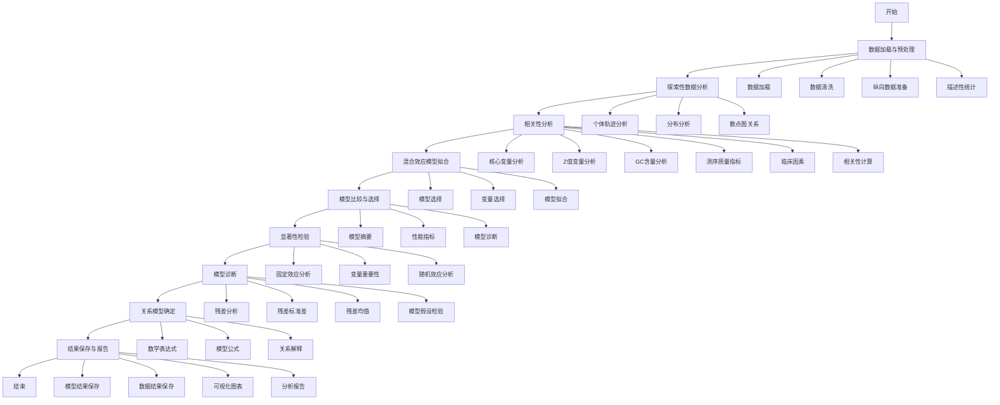
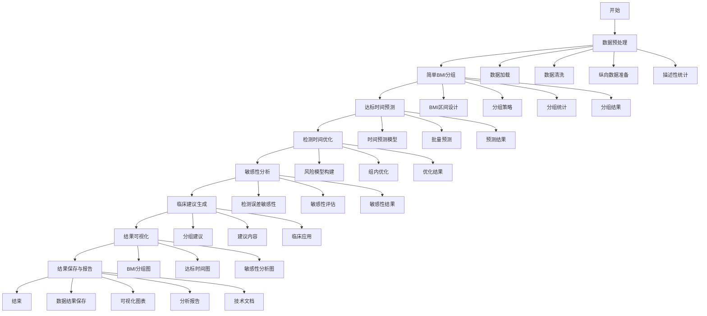
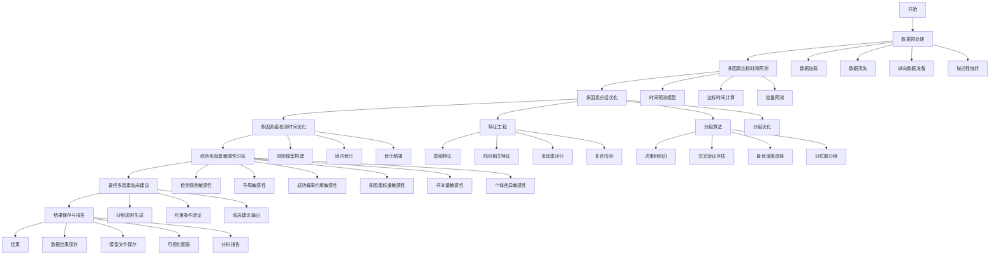
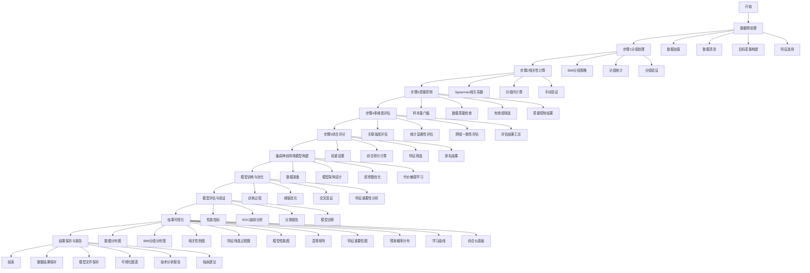
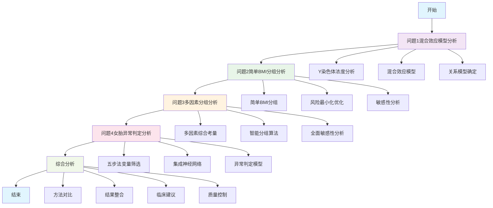
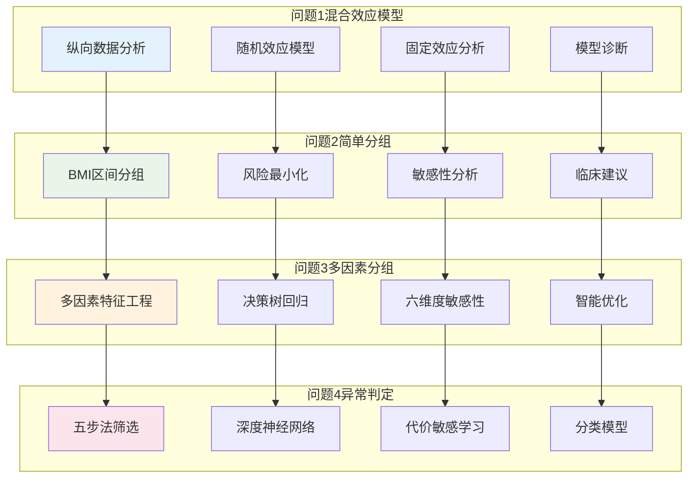
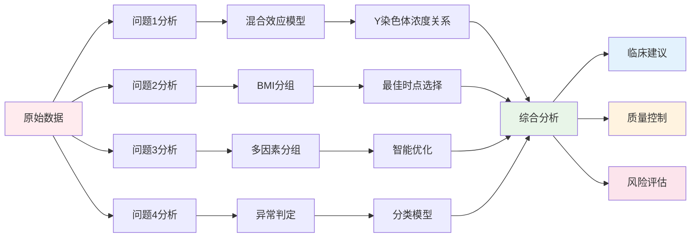

# 四个问题分析流程图

## 问题1：NIPT Y染色体浓度混合效应模型分析流程图

## 问题2：BMI分组和NIPT最佳时点选择流程图

## 问题3：多因素BMI分组和NIPT最佳时点选择流程图

## 问题4：女胎异常判定分析流程图

## 四个问题综合分析流程图

## 技术方法对比图

## 数据流向图

## 关键创新点总结

### 问题1创新点
- **混合效应模型**：处理纵向数据的个体差异
- **多变量分析**：综合考虑多个影响因素
- **模型诊断**：确保模型的有效性

### 问题2创新点
- **简化分组**：基于BMI的简单有效分组
- **风险最小化**：优化检测时间降低风险
- **敏感性分析**：评估误差对结果的影响

### 问题3创新点
- **多因素综合**：考虑BMI、年龄、身高、体重等多个因素
- **智能分组**：使用决策树回归进行智能分组
- **全面敏感性**：六维度敏感性分析

### 问题4创新点
- **五步法筛选**：系统化的变量筛选方法
- **深度神经网络**：处理复杂的非线性关系
- **代价敏感学习**：处理类别不平衡问题

这些流程图清晰地展示了四个问题的分析流程，从简单到复杂，从单一因素到多因素，从描述性分析到预测性建模，形成了一个完整的NIPT检测分析体系。